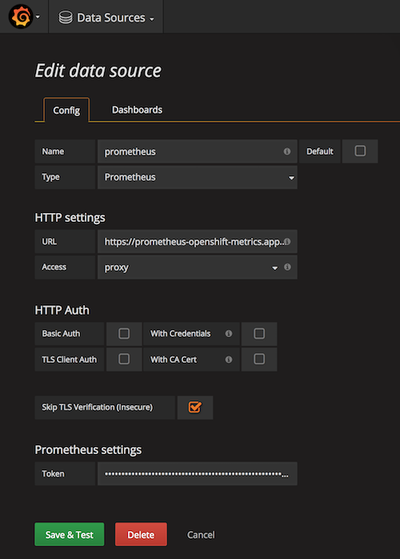

Data Grid / Infinispan - JMX Exporter Prometheus Metrics
================================================================

This project builds a custom image of Red Hat Data Grid / Infinispan in order to gather metrics using Prometheus (open source monitoring and alerting toolkit) and display them in Grafana.

## Prerequisites

* Requires Openshift Container Platform 3.9 or greater with Prometheus and Grafana installed
* Requires JBoss Data Grid 7.2 image and associated templates deployed on OCP

## Build and configure Data Grid

###### Clone the GitHub project in your local environment
```
git clone https://github.com/mcouliba/datagrid-prometheus.git
cd datagrid-prometheus
```

###### Create a new project (or use an existing)
```
oc new-project datagrid
```

###### Build the custom Data Grid image including JMX Exporter Prometheus
```
oc new-build https://github.com/mcouliba/datagrid-prometheus.git --name=datagrid72-prometheus --strategy=docker
```

###### Create the ConfigMap with JMX Exporter parameters
```
oc create configmap datagrid-prometheus --from-file=config.yaml
```

## Deploy and run Data Grid
* Create the template _"datagrid72-prometheus-basic"_
```      
oc create -f datagrid72-prometheus-basic.yaml
oc describe template datagrid72-prometheus-basic
```

* Deploy the custom image using the imported template 
```    
oc new-app --template=datagrid72-prometheus-basic --name=rhdg \
  -p USERNAME=developer -p PASSWORD=developer -p IMAGE_STREAM_NAMESPACE=datagrid \
  -e CACHE_NAMES=mycache -e MYCACHE_CACHE_START=EAGER
```

## Configure Prometheus
* Update the _prometheus.yml_ file into the _prometheus_ ConfigMap as following. 
We are going to collect metrics from all pods with a port name called _"prometheus"_ of the the project _datagrid_.
```
oc describe configmap prometheus -n openshift-metrics

Data
====
prometheus.yml:
----
scrape_configs:
- job_name: 'datagrid-prometheus-metrics'
  kubernetes_sd_configs:
  - role: endpoints
    namespaces:
      names:
      - datagrid
  relabel_configs:
  - source_labels: [__meta_kubernetes_pod_container_port_name]
    action: keep
    regex: prometheus
```

* Check the targets in Prometheus https://prometheus-openshift-metrics.example.org/targets


## Configure Grafana
### Create/edit datasource for Prometheus
| Parameter | Value |
| --- | --- |
| URL | https://prometheus-openshift-metrics.example.org |
| Token | Result of the command `oc sa get-token prometheus-reader -n openshift-metrics` |



### Import the dashboard _datagrid-grafana-dashboard.json_


## Congratulations
You are now displaying Data Grid metrics using Prometheus and Grafana.

